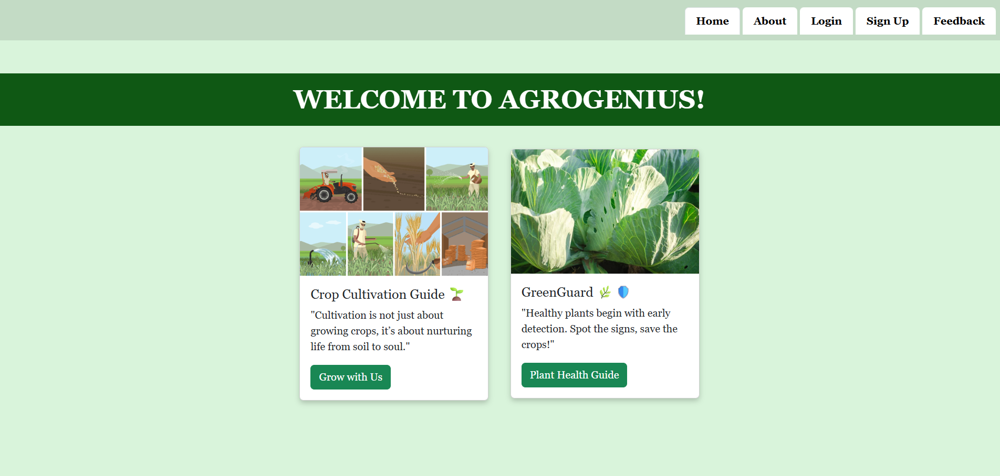
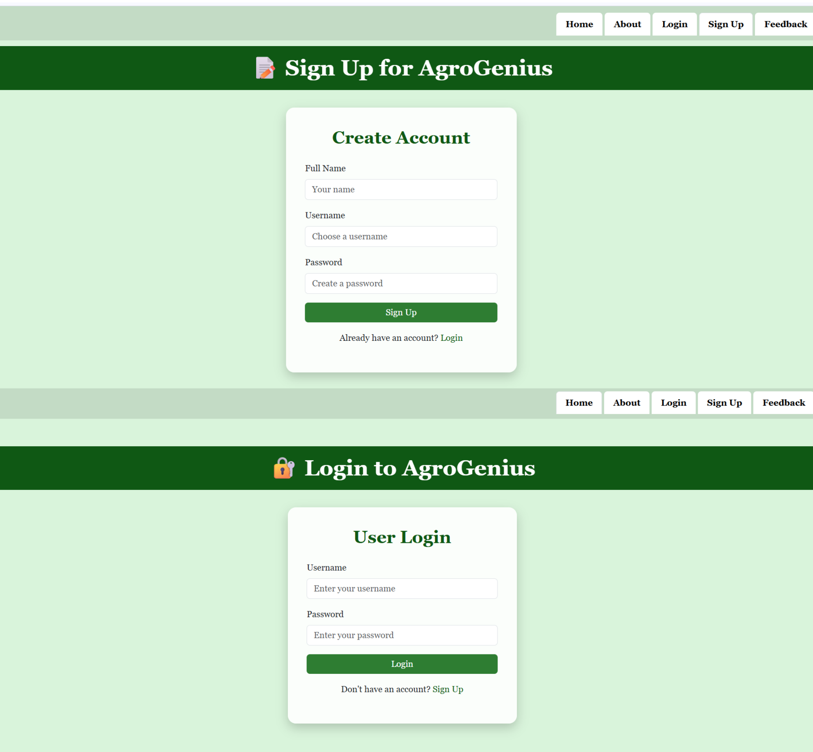
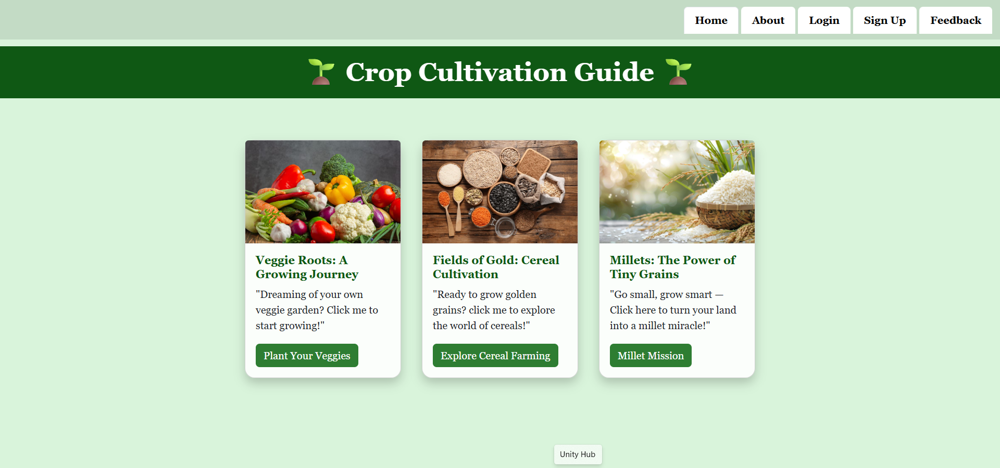
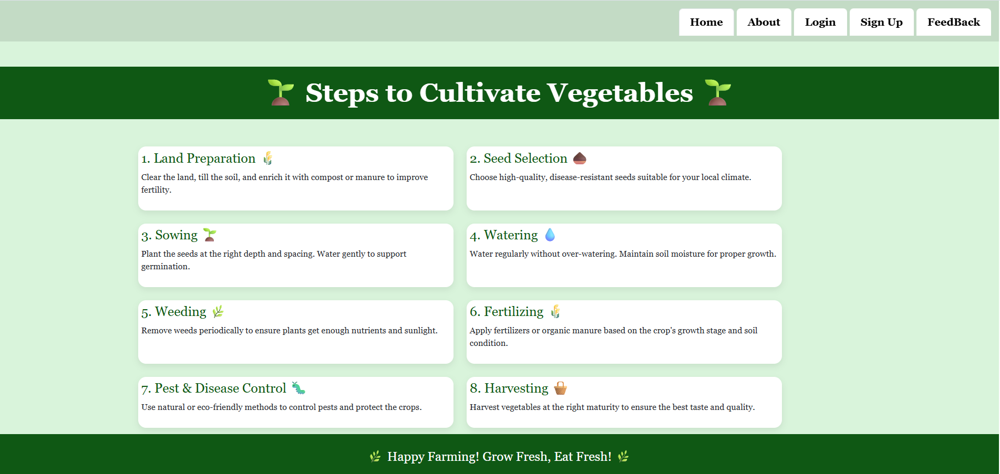
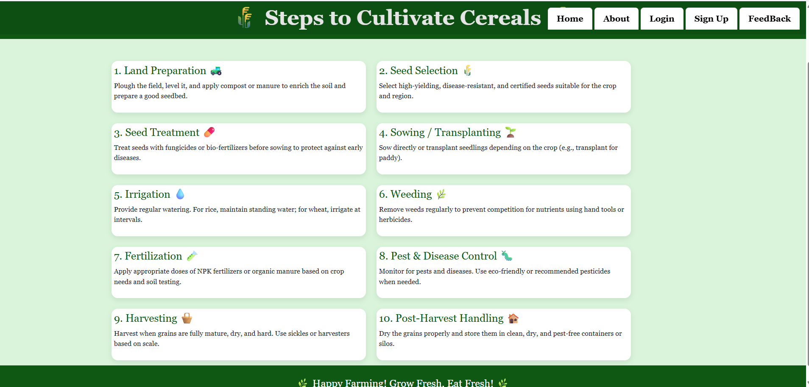
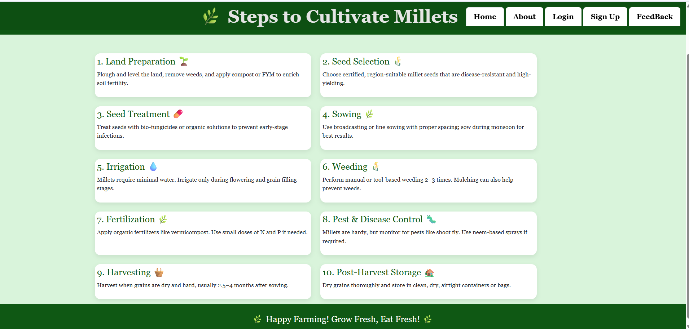

## Problem Description

Awareness about agriculture, crop cultivation, and healthy food choices is declining, especially among students and urban populations. Many lack knowledge of crop types, their nutritional benefits, and sustainable farming practices. This website bridges that gap by providing a **digital platform** to educate users about different crops, their cultivation process, and environmental importance. It emphasizes traditional crops like millets, promotes sustainable agriculture, and guides users step-by-step through the farming lifecycle, from soil preparation to harvesting.
## Project Screenshots

### 1. Home Page
  
The landing page introduces the platform, highlights the importance of agriculture, and provides easy navigation to crop types, farming steps, and sustainable practices.

### 2. Login / Sign-In Page
  
A secure and user-friendly interface for users to log in or register, enabling personalized experiences and feedback submission.

### 3. Crop Selection Page
  
Users can explore major crop categories like cereals, millets, and vegetables, with information on nutritional value, environmental benefits, and traditional importance.

### 4. Step-by-Step Farming Process Page
Shows the complete agricultural lifecycle in a structured manner, guiding users through soil preparation, sowing, cultivation, harvesting, and storage.

#### Sub-Steps for Different Crops

- **Vegetables**
    
  Detailed steps for vegetable cultivation, including planting, irrigation, and harvesting practices.

- **Cereals**
    
  Step-by-step guide for cereal crops, covering sowing, growth management, and harvesting.

- **Millets**
    
  Sustainable farming process for millets, emphasizing traditional methods and climate-resilient practices.
